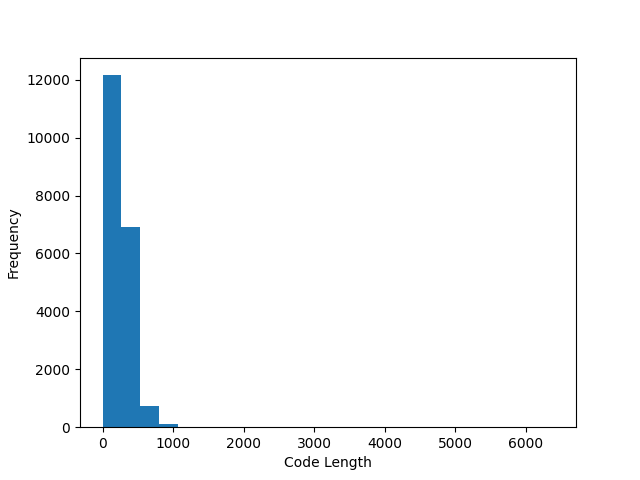
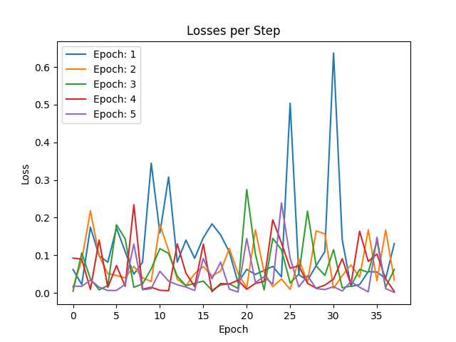
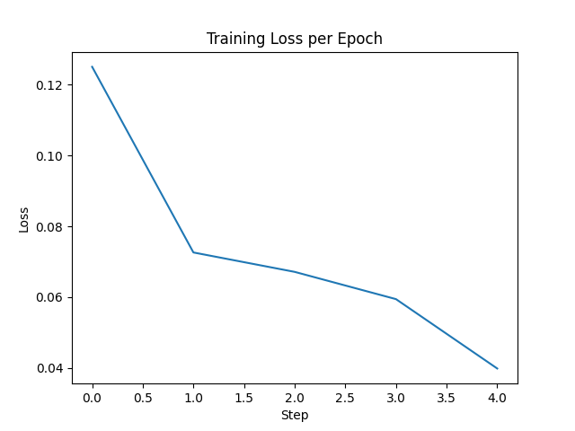

# README: ML for Context in AI Assistant

This is the GitHub repository of Andrei Oprescu for the implementation of the JetBrains Internship task.
Below you can find commentaries on the tasks given, as well as instructions on how to run the search-engine model and API.

search_engine.ipynb is the file demonstrating all 3 tasks. It was put together after the making of search_engine.py, which is the more 'complete' product because of its customizbility.

## Project Description

### Using the Model Through the API

To run the API, find the "api.py" file in src. Running this file will start the api which can receive requests for queries
To query the model, send the following request:

POST http://127.0.0.1:8000/search
Content-Type: application/json

{
  "query": "YOUR QUERY HERE"
}

The returned response will be in the JSON format and will look like this:

{
  "results": [
    {
      "filename": "cosqa-dev-6",
      "content_snippet": "def write_color(string, name, style='normal', when='auto'):\n    \"\"\" Write the given colored string to standard out. \"\"\"\n    write(color(string, name, style, when))..."
    },
    {
      "filename": "cosqa-dev-400",
      "content_snippet": "def write_color(string, name, style='normal', when='auto'):\n    \"\"\" Write the given colored string to standard out. \"\"\"\n    write(color(string, name, style, when))..."
    }
    ... (the remaining 8 results)
  ]
}

### Project Structure

In the src folder is the functionality of the model. Within the files, you can find more detailed in-line documentation 

#### src Folder

search_engine.py: This file contains the model running script. Here, the dataset is loaded and the model is either trained, tested or demoed (for task #1) depending on the MODE variable in config.py.

search_engine.ipynb: This is the Jupyter Notebook equivalent of search_engine.py. This file demonstrates the tasks given.

Utils.py: Here, most of the functionality is held. Here wou can find methods for the training pipeline, model testing and evaluation, dataset formatting and vector storage and retrieval

Config.py: This file contains configuration variables. This includes the run mode (TRAIN, TEST, DEMO), debugging mode, which pretrained model to use and which device to train on.

Metrics.py: Class made to calculate and retrieve metrics based on the answers of the model.

api.py: Runs the API, and specifies its requests.

## Tasks

Please note that the code was originally made in the search_engine.py file. This means that a lot of the code structure was intended for this file.

## Task 1: Embeddings-based search engine

For the implementation of the search engine, I used the all-MiniLM-L6-v2 sentence transformer from HuggingFace. 
To store and retrieve the embedding vectors, I used the FAISS index, which performs brute-force L2 distance retrieval.

## Task 2: Evaluation

The CoSQA dataset provided with the task showed strange values (https://huggingface.co/datasets/CoIR-Retrieval/cosqa), which were not representative of a search-engine task.
Therefore, I got another CoSQA dataset from HuggingFace that offered data fit for the task at hand:
https://huggingface.co/datasets/gonglinyuan/CoSQA/viewer/default/validation?views%5B%5D=validation

### Implementing Metrics

For the implementation of metrics, I created the Metrics class in Metrics.py. The class accepts the top k results returned by the model and the target result.
By calling recall_10(), mrr_10() and ndgc_10(), you can get the metrics for the given query result.

### Calculating Metrics

In the method "search_engine_test()", for each query in the validation set, the 3 metrics are calculated.
To get the average of each metric, the "get_averages(all_metrics)" method is used in the Metrics class, which returns the averages in a 3-tuple

For the untrained model, these are the following metrics on the validation set:

RECALL@10 AVERAGE: 0.9668874172185431  
MRR@10 AVERAGE: 0.9668874172185431  
NDGC@10 AVERAGE: 0.804717351117915  

Since I only considered if the correct answer was in the top 10 (i.e. the other answers in the top 10 did not have a relevance score), the following calculations were performed.

*RECALL@10:* This now essentially becomes ACCURACY@10.   
If the answer is in the top 10, the metric is 1.   
Otherwise, 0.  

*MRR@10:*  
If target answer in top 10: return 1/rank  
If target answer not in top 10: return 0  

*NDGC@10:*  
If target answer in top 10: return '1 / math.log(rank + 1, 2)'  
If target answer not in top 10: return 0  

## Task 3: Fine-tuning

After plotting a histogram of the lengths of the code examples, I saw that there was a great amount that had between 256 and 512 characters (and even more with less than 256 characters). 
Since the model (by default) truncates the input to 256 characters, I truncated the inputs at 512 characters for better accuracy.

For the loss function, I chose the MultipleNegativesRankingLoss. This loss "pulls" the anchor to its code example closer, and "pushes" the anchor away from the other positive examples from its batch.
This helps the model to get better at distinguishing between relevant and irrelevant code samples for the given query, which is why I chose it.

After training the model, the metrics visibly improve:

RECALL@10 AVERAGE: 1.0  
MRR@10 AVERAGE: 1.0  
NDGC@10 AVERAGE: 0.8937993660387458  

This was done with the following hyperparameters:

batch size: 16  
input length: 512  
learning rate: 0.00002  
shuffle: True  
epochs: 5  
warmup: 50  

I was also curious to see how the model would do with an input length of 256. These are the metrics:

RECALL@10 AVERAGE: 1.0  
MRR@10 AVERAGE: 1.0  
NDGC@10 AVERAGE: 0.8932661320064853  

Even though the NDGC@10 does decrease slightly, it's not a big difference. The reason could also be because the metrics are already quite high already anyway.

With 5 epochs, the following losses were logged:

As can be seen from the second graph, the losses decrease as the model trains on more epochs, showing that it gets more accurate.
